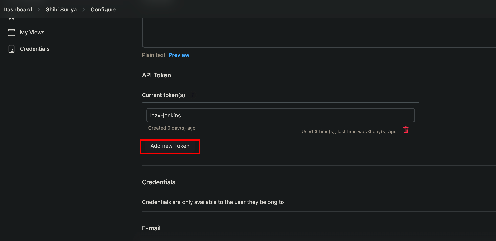

# kf-lazy-jenkins

Trigger Jenkin jobs in Kissflow with 1/4 brain cells...

## How to install?

- Clone the repo.

- Install the app globally.

```bash
cd lf-lazy-jenkins
npm i
npm i -g .
```

# Create a token in Jenkins



# The .env

- Create a .env file in lazy-jenkin's root.

- Paste the copied API token into the .env file.

- Paste your username into the .env file.

Your .env file must look like this,

```bash
API_TOKEN=alskjdajkjalksjdkasdkasd
USERNAME=shibi@kissflow.com
```

## How to run the app?

```bash
lj
```
